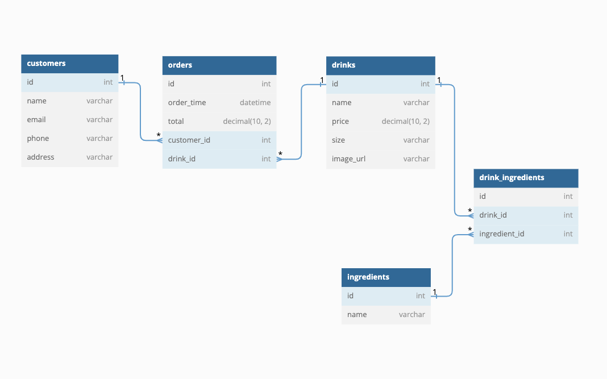

# Coffee Shop APP BackEnd

## Backend and Front-end Interfaces

You can use this API alone: [see the repo](https://github.com/Spanglishgaby/CoffeeShop-BackEnd)

You can use this **front-end** app alone: [see the repo](https://github.com/Spanglishgaby/CoffeeShop-FrontEnd)

## Backend Technologies Used 
The focus of this project is **building a Sinatra API backend** that uses **Active Record** to access and persist data in a database, which will be used by a separate **React frontend** that interacts with the database via the API.

## Project Requirements:
* Use Active Record for database interaction
* Create at least two models with one-to-many relationship
* Setup CRUD API routes in Sinatra
* Build a separate React frontend application that interacts with the API for CRUD actions
* Implement proper front-end state management using setState after POST, PATCH, or DELETE
* Use good OO design patterns, create separate classes for models with instance and class methods
* Follow RESTful conventions for routes
* Optimize backend by passing related association data as JSON to frontend using Active Record methods

## How To Use

### Install it and run:
```console
  bundle install

# create migrations with activerecord
  rake db:migrate

# if you would like to use seed data
  rake db:seed

# You can start your server with:
  $ bundle exec rake server
```

This will run your server on port
[http://localhost:9292](http://localhost:9292).

### Associations:

* The **"customers"** table represents individual customers who have made orders.
* The **"orders"** table represents individual orders that have been made, each of which belongs to a single customer and contains information such as the total price and the time the order was made.
* The **"drinks"** table represents the different types of drinks that are available for purchase, and contains information such as the name, price, size, and image URL.
* The **"ingredients"** table represents the different ingredients that can be used to make the drinks.
* The **"drink_ingredients"** table is a join table that connects drinks with their ingredients, allowing for the creation of custom drinks with specific ingredients.

### Fetch Example

####Drinks
You can make all CRUD calls for the drinks database.

* CREATE drinks
* GET/RETRIEVE all drinks
* GET/RETRIEVE individual drink
* DELETE a drink
* UPDATE a drink

**Example:** Retrieve All drinks
Shows you drinks 

```js
fetch("http://localhost:9292/drinks")
  .then((r) => r.json())
  .then((data) => console.log(data));

  //Output
  [
{
"id": 1,
"name": "Americano",
"price": "2.5",
"size": null,
"created_at": "2023-02-10T18:30:34.326Z",
"updated_at": "2023-02-15T23:45:57.769Z",
"image_url": "https://images.unsplash.com/photo-1514432324607-a09d9b4aefdd"
},
{
"id": 2,
"name": "Latte",
"price": "2.5",
"size": null,
"created_at": "2023-02-10T18:31:25.518Z",
"updated_at": "2023-02-16T02:12:31.253Z",
"image_url": "https://images.unsplash.com/photo-1523288714565-cca0bdf81acf"
},
{
"id": 3,
"name": "Cappuccino",
"price": "3.5",
"size": "small",
"created_at": "2023-02-10T18:31:49.439Z",
"updated_at": "2023-02-10T18:31:49.439Z",
"image_url": "https://images.unsplash.com/photo-1593443320739-77f74939d0da"
},
]
```
**Example:** Retrieve a Specific Drink
```js
fetch("http://localhost:9292/drinks/1")
  .then((r) => r.json())
  .then((data) => console.log(data));

  //Output
[
  {
  "id": 1,
  "name": "Americano",
  "price": "2.5",
  "size": null,
  "created_at": "2023-02-10T18:30:34.326Z",
  "updated_at": "2023-02-15T23:45:57.769Z",
  "image_url": "https://images.unsplash.com/photo-1514432324607-a09d9b4aefdd"
  },
]
```  
**Example:** Create a Drink
```js
fetch('http://localhost:9292/drinks/', {
      method: 'POST',
      headers: {
        'Content-Type': 'application/json',
        accept: 'application/json',
      },
      body: JSON.stringify({
        name: 'New Drink',
        price: 2.5,
        size: 'small',
      }),
    })

  //Output
{
    "drink": {
        "id": 11,
        "name": "New Drink",
        "price": 2.5,
        "size": "small",
        "created_at": "2023-02-10 18:34:36.460685",
        "updated_at": "2023-02-10 18:34:36.460685",
        
    }
}
```  
**Example:** Delete a Drink
```js
fetch(`http://localhost:9292/drinks/11`, {
      method: 'DELETE',
    })
```
## Resources

- [create-react-app][]
- [dbdiagram.io][]
- [Postman][postman download]

[create-react-app]: https://create-react-app.dev/docs/getting-started
[dbdiagram.io]: https://dbdiagram.io/
[postman download]: https://www.postman.com/downloads/
